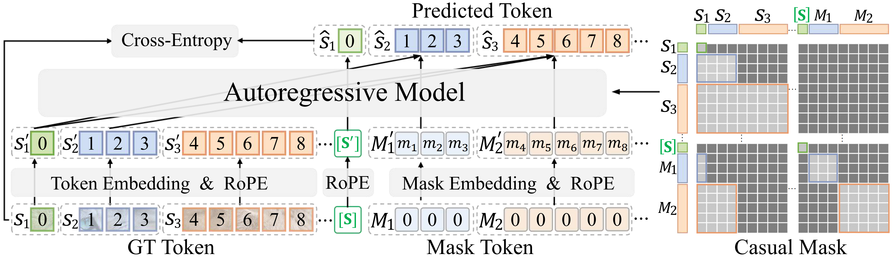

# Learning to Expand Images for Efficient Visual Autoregressive Modeling


<div align="center">

<!-- [](https://huggingface.co/spaces/FoundationVision/LlamaGen)&nbsp;
[](https://arxiv.org/abs/2406.06525)&nbsp;
[](https://peizesun.github.io/llamagen/)&nbsp; -->


</div>


## Introduction
We introduce EAR, a new "next-any-tokens prediction" paradigm for efficient and high-quality visual generation. EAR achieves state-of-the-art generation quality and efficiency trade-off for image generation tasks. All the training codes, data and models are open-sourced.

All pretrained models can be downloaded from [HuggingFace](https://huggingface.co/FoodBamboo/EAR/tree/main) (More weights will be coming soon!).

## 🔥 Update
- [2025.11.19] training and sampling code are released !

## Getting Started
See [Getting Started](GETTING_STARTED.md) for installation, training and evaluation.


## BibTeX
```bibtex
@article{,
  title={},
  author={},
  journal={},
  year={}
}
```
